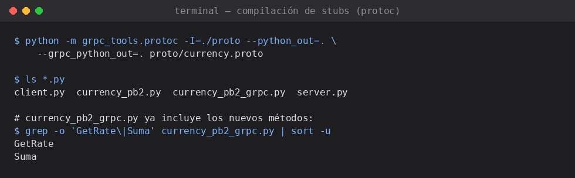
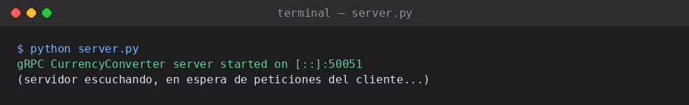
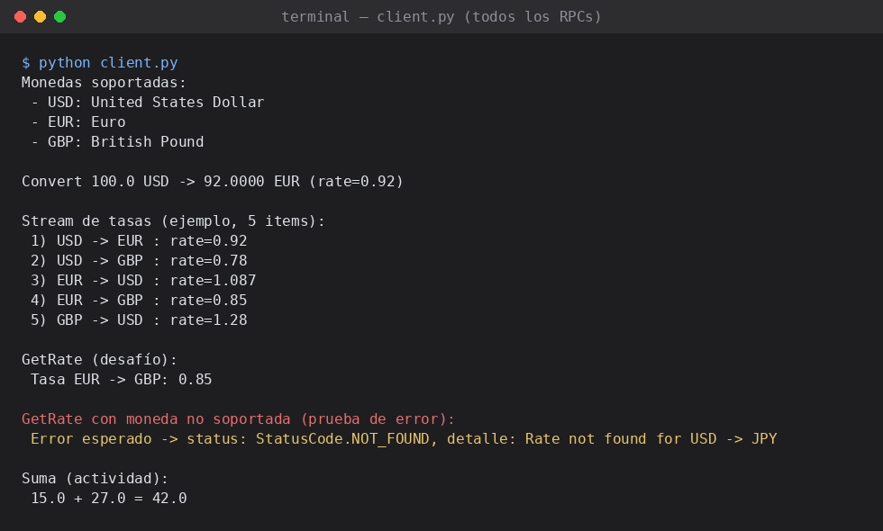

# Laboratorio gRPC — Servicio de Conversión de Monedas (fork personal)

Fork personal del laboratorio [`grpc-currency-lab`](https://github.com/joseluisnaranjo/grpc-currency-lab)
de Remote Procedure Call (RPC) con **gRPC** y **Protocol Buffers**.

Se ejecutaron los 3 RPCs originales del servicio (`Convert`, `GetSupportedCurrencies`,
`StreamRates`), se implementó el desafío `GetRate` propuesto en el repositorio base, y
se agregó el método adicional `Suma` pedido en la actividad, modificando el `.proto`,
recompilando los stubs, e implementando/llamando el método en `server.py` y `client.py`.

## Estructura del repositorio

```
.
├── README.md
├── requirements.txt
├── proto/
│   └── currency.proto        # .proto modificado (agrega GetRate y Suma)
├── server.py                 # Implementa los 5 RPCs
├── client.py                 # Llama a los 5 RPCs
├── currency_pb2.py           # Generado por protoc (no editar a mano)
├── currency_pb2_grpc.py      # Generado por protoc (no editar a mano)
└── screenshots/
    ├── 01_compilacion_stubs.png
    ├── 02_servidor.png
    └── 03_cliente_completo.png
```

## 1. Preparación del entorno

```bash
git clone <URL-de-este-fork>
cd grpc-currency-lab
python3 -m venv venv
source venv/bin/activate        # Windows: venv\Scripts\activate
pip install -r requirements.txt
```

## 2. Generación de los stubs

Cada vez que se modifica `proto/currency.proto` hay que recompilarlo:

```bash
python -m grpc_tools.protoc -I=./proto --python_out=. --grpc_python_out=. proto/currency.proto
```

Esto (re)genera `currency_pb2.py` y `currency_pb2_grpc.py`, que ya incluyen los
nuevos mensajes/métodos `GetRate` y `Suma`.

**Captura de la compilación:**



## 3. Ejecutar el servidor

```bash
python server.py
```

**Captura del servidor en ejecución:**



## 4. Ejecutar el cliente (en otra terminal)

```bash
python client.py
```

**Captura de la ejecución completa del cliente**, mostrando los 5 RPCs
(los 3 originales + `GetRate` + `Suma`), incluyendo la prueba de una tasa
inexistente para verificar el manejo de errores:



---

## Explicación de cada RPC ejecutado

### 1. `Convert` — RPC Unary
El cliente envía un `ConvertRequest` (moneda origen, moneda destino, monto) y
recibe un único `ConvertReply` con el monto convertido y la tasa usada. Es la
forma más simple de RPC: una petición, una respuesta, como una llamada de
función normal pero a través de la red.

```
Convert 100.0 USD -> 92.0000 EUR (rate=0.92)
```

### 2. `GetSupportedCurrencies` — Server-Streaming
El cliente envía una petición vacía (`Empty`) y el servidor responde con un
**stream** de mensajes `Currency`, uno por cada moneda soportada. El cliente
los va recibiendo y procesando uno a uno con un simple `for`, sin tener que
esperar a que estén todos listos de antemano.

```
Monedas soportadas:
 - USD: United States Dollar
 - EUR: Euro
 - GBP: British Pound
```

### 3. `StreamRates` — Server-Streaming (opcional)
Similar al anterior, pero el servidor genera un flujo (potencialmente
infinito) de tasas simuladas con una pequeña espera entre cada envío
(`time.sleep(0.5)`), simulando actualizaciones periódicas de precios. El
cliente decide cuándo dejar de escuchar (aquí, tras 5 elementos).

```
Stream de tasas (ejemplo, 5 items):
 1) USD -> EUR : rate=0.92
 2) USD -> GBP : rate=0.78
 3) EUR -> USD : rate=1.087
 4) EUR -> GBP : rate=0.85
 5) GBP -> USD : rate=1.28
```

### 4. `GetRate` — RPC Unary (desafío del repositorio)
Se agregó siguiendo la guía del README original:

**Cambios en `proto/currency.proto`:**
```protobuf
message RateRequest {
  string from_currency = 1;
  string to_currency = 2;
}

message RateReply {
  double rate = 1;
}

// dentro de service CurrencyConverter:
rpc GetRate(RateRequest) returns (RateReply);
```

**Implementación en `server.py`:** reutiliza la misma lógica de búsqueda de
tasa que `Convert`, pero devuelve solo el `RateReply` con la tasa, sin
calcular ninguna conversión de monto.

**Llamada en `client.py`:** se probó tanto un caso exitoso (`EUR -> GBP`)
como un caso de error a propósito (`USD -> JPY`, moneda no soportada) para
verificar el manejo de errores:

```
GetRate (desafío):
 Tasa EUR -> GBP: 0.85

GetRate con moneda no soportada (prueba de error):
 Error esperado -> status: StatusCode.NOT_FOUND, detalle: Rate not found for USD -> JPY
```

### 5. `Suma` — RPC Unary (actividad solicitada)
Se agregó un RPC adicional, independiente de la lógica de monedas, que
recibe dos números y devuelve su suma — para practicar el ciclo completo
de modificar el `.proto`, recompilar y usar un nuevo método de punta a
punta.

**Cambios en `proto/currency.proto`:**
```protobuf
message SumaRequest {
  double a = 1;
  double b = 2;
}

message SumaReply {
  double resultado = 1;
}

// dentro de service CurrencyConverter:
rpc Suma(SumaRequest) returns (SumaReply);
```

**Implementación en `server.py`:**
```python
def Suma(self, request, context):
    resultado = request.a + request.b
    return currency_pb2.SumaReply(resultado=resultado)
```

**Resultado:**
```
Suma (actividad):
 15.0 + 27.0 = 42.0
```

---

## Preguntas de control

**¿Qué diferencia hay entre una RPC unary y server-streaming?**

En una **RPC unary** el cliente envía una única petición y el servidor
devuelve una única respuesta, igual que una llamada de función tradicional
(petición → respuesta → fin). Es el patrón usado en `Convert`, `GetRate` y
`Suma`.

En una **RPC server-streaming**, el cliente envía una única petición, pero
el servidor puede devolver **múltiples mensajes en secuencia** a través de
la misma conexión, que el cliente va leyendo uno a uno (por ejemplo con un
`for item in stream:`). El servidor decide cuántos mensajes enviar y cuándo
cerrar el stream (o, como en `StreamRates`, puede enviarlos indefinidamente
hasta que el cliente corte la conexión). Es útil cuando el resultado es una
colección que puede procesarse de forma incremental —como la lista de
monedas soportadas o una serie de actualizaciones periódicas de tasas— en
vez de esperar a tener todo el resultado antes de mandar nada.

**¿Cómo manejarías el caso de una tasa no encontrada en el servidor?**

Tal como implementa el propio `server.py` (y se replicó en `GetRate`): en
vez de devolver una respuesta "vacía" o con un valor por defecto engañoso
(como `rate=0`), se usa el mecanismo de **estados de error de gRPC**:

```python
context.set_code(grpc.StatusCode.NOT_FOUND)
context.set_details(f"Rate not found for {from_c} -> {to_c}")
return currency_pb2.RateReply()
```

Esto le indica explícitamente al cliente, a nivel de protocolo, que la
petición no pudo completarse y por qué (`NOT_FOUND` es más semántico que un
código genérico). Del lado del cliente, esto se captura como una excepción
`grpc.RpcError`, de la cual se puede leer `e.code()` y `e.details()` para
mostrar un mensaje adecuado o decidir un plan alternativo (por ejemplo,
intentar invertir la tasa si existe en sentido contrario —algo que
`Convert`/`GetRate` ya hacen antes de rendirse—, usar una tasa por defecto,
o consultar una API externa como Frankfurter/ExchangeRate-API antes de
fallar). Lo importante es **no silenciar el error** devolviendo un valor
numérico ambiguo, sino usar los códigos de estado estándar de gRPC para que
cualquier cliente (no solo este) sepa interpretarlo correctamente.

---

## Resumen de RPCs implementados

| RPC                       | Tipo              | Petición         | Respuesta              |
|----------------------------|-------------------|-------------------|--------------------------|
| `Convert`                  | Unary              | `ConvertRequest`  | `ConvertReply`           |
| `GetSupportedCurrencies`   | Server-Streaming   | `Empty`           | `stream Currency`        |
| `StreamRates`               | Server-Streaming   | `Empty`           | `stream ConvertReply`    |
| `GetRate` *(nuevo)*         | Unary              | `RateRequest`     | `RateReply`              |
| `Suma` *(nuevo)*            | Unary              | `SumaRequest`     | `SumaReply`              |
